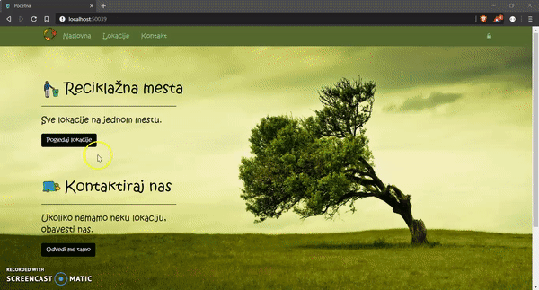

# Reciklaza

## **_.NET Web Application (MVC) for displaying recycle locations in a country_**

### Features:
- Users can view the locations and filtrate the results by the city they choose
- The app has an admin side, which uppon logging in can add, edit, or remove an existing location. The administrator can also add new materials that can be recycled
- Each location has its information and price of the material it is recycling
- Users can calculate their profit in a mini calculator in each of the locations details

## Demo:

**built for the purposes of learning web application development**

**LANGUAGE:** Serbian
